# Agora Assistant Chatbot – Python Intelligent Campus Assistant


A Python-based intelligent campus assistant built with Flask, MongoDB Atlas, MongoDB GridFS, Groq AI, and optimized MongoDB retrieval. The application provides a College Lasalle-style intranet portal where students, teachers, and administrators can access documents, book appointments, use an AI chatbot, view conversation history, and interact with an embedded chatbot widget.

This project was developed as the Python-based equivalent version of the main Agora Assistant Chatbot project. It focuses on backend logic, AI-assisted retrieval, role-based access, document management, PDF storage, chatbot reliability, and deployment-ready architecture.

The deployed version is optimized for the Render free plan by avoiding heavy machine learning libraries such as `sentence-transformers`, `torch`, `tensorflow`, and `transformers`. Instead, the chatbot uses an optimized standard MongoDB retrieval system with tokenized scoring, regex filtering, role-based filtering, multi-field context extraction, and strict AI guardrails.

---

## Table of Contents

* [Live Deployment](#live-deployment)
* [Project Overview](#project-overview)
* [Screenshots](#screenshots)
* [Main Features](#main-features)
* [AI Chatbot System](#ai-chatbot-system)
* [Optimized MongoDB Retrieval](#optimized-mongodb-retrieval)
* [Why Vector Search Is a Future Improvement](#why-vector-search-is-a-future-improvement)
* [Chatbot Retrieval Problems Fixed](#chatbot-retrieval-problems-fixed)
* [Embedded Chatbot Widget](#embedded-chatbot-widget)
* [Document Center and PDF Storage](#document-center-and-pdf-storage)
* [Appointment Management](#appointment-management)
* [Conversation History](#conversation-history)
* [REST API Endpoints](#rest-api-endpoints)
* [Technology Stack](#technology-stack)
* [System Architecture](#system-architecture)
* [Chatbot Workflow](#chatbot-workflow)
* [MongoDB Database Structure](#mongodb-database-structure)
* [Project Folder Structure](#project-folder-structure)
* [Sprint Progress](#sprint-progress)
* [Installation Guide](#installation-guide)
* [Environment Variables](#environment-variables)
* [Deployment Guide](#deployment-guide)
* [API Examples](#api-examples)
* [Testing Checklist](#testing-checklist)
* [Security Features](#security-features)
* [Known Limitations](#known-limitations)
* [Future Improvements](#future-improvements)
* [Project Status](#project-status)
* [Author](#author)
* [Conclusion](#conclusion)

---

## Live Deployment

The project is deployed on Render.

```text
https://agora-chatbot-python.onrender.com
```

Login page:

```text
https://agora-chatbot-python.onrender.com/login
```

---

## Project Overview

The Agora Assistant Chatbot is a Python-based intelligent assistant platform designed for a College Lasalle-style intranet environment. It helps students, teachers, and administrators access institutional information through a centralized web portal.

The system combines:

* Flask web application
* MongoDB Atlas cloud database
* MongoDB GridFS PDF file storage
* Groq AI response generation
* Optimized MongoDB chatbot retrieval
* Role-based access control
* Appointment request workflow
* Conversation history tracking
* Embedded chatbot widget
* Render deployment support

The chatbot does not simply answer from general knowledge. It first retrieves relevant database context from MongoDB and then sends that context to Groq AI. If the database context does not contain the answer, the chatbot is instructed to respond clearly that the information cannot be found in the database.

This approach improves reliability and reduces unsupported AI-generated answers.

---

## Screenshots

Screenshots are included to demonstrate the final working system.

### Login Page

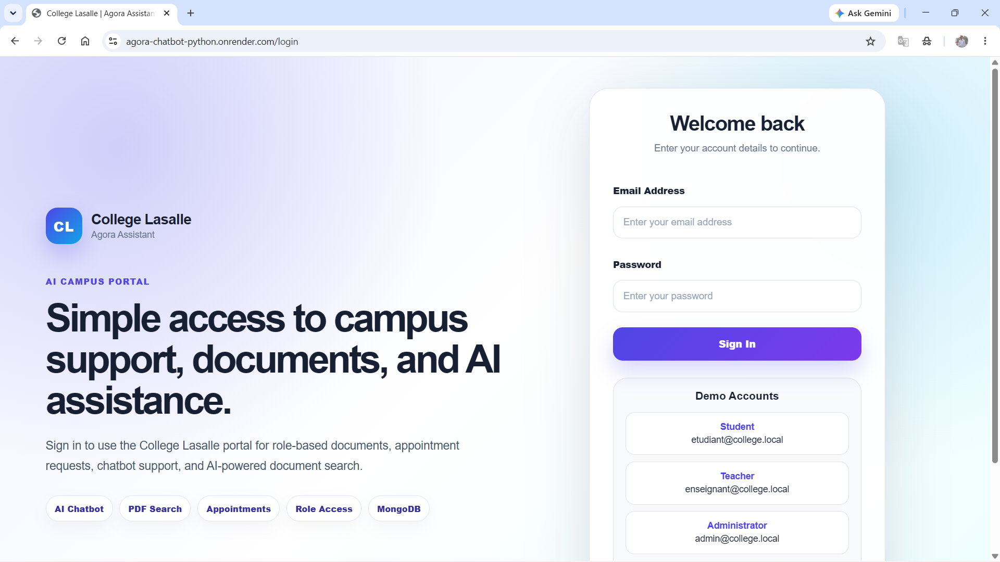

### Demo Portal

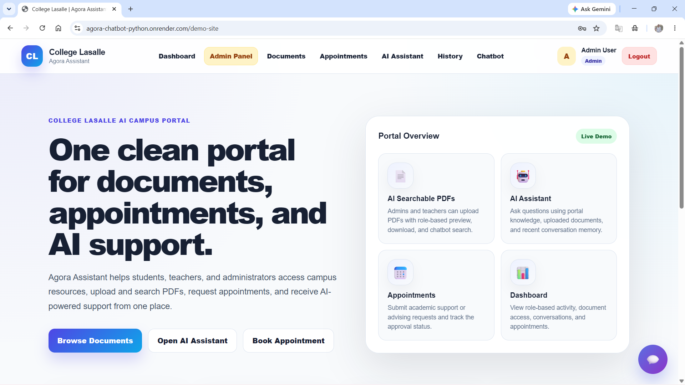

### Dashboard

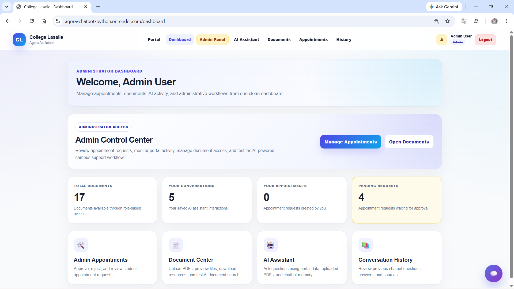

### Chatbot Page

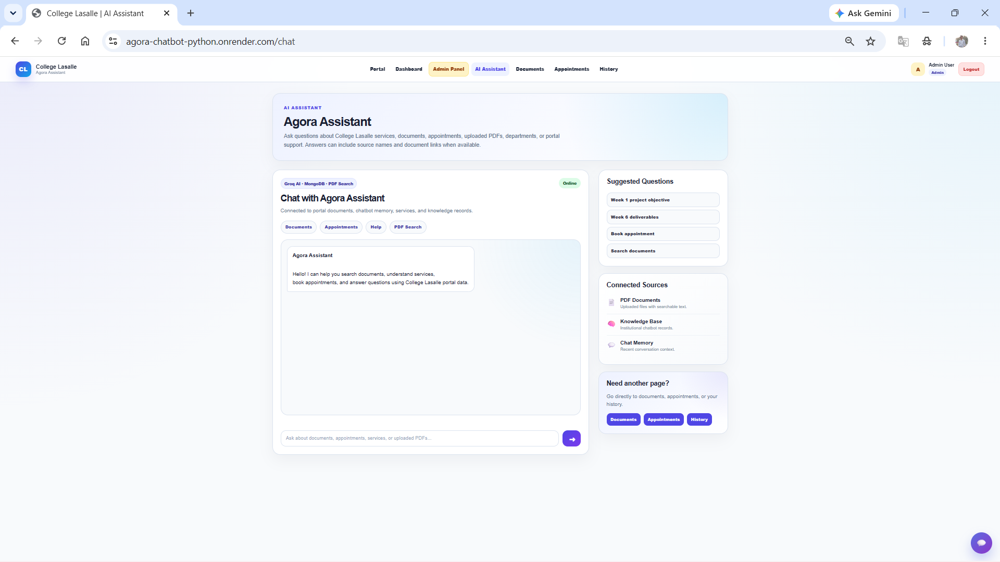

### Embedded Chatbot Widget

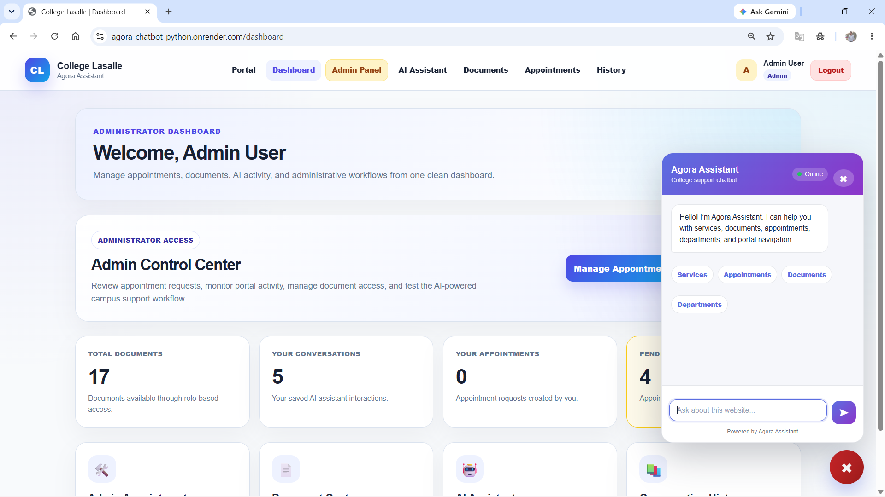

### Document Center

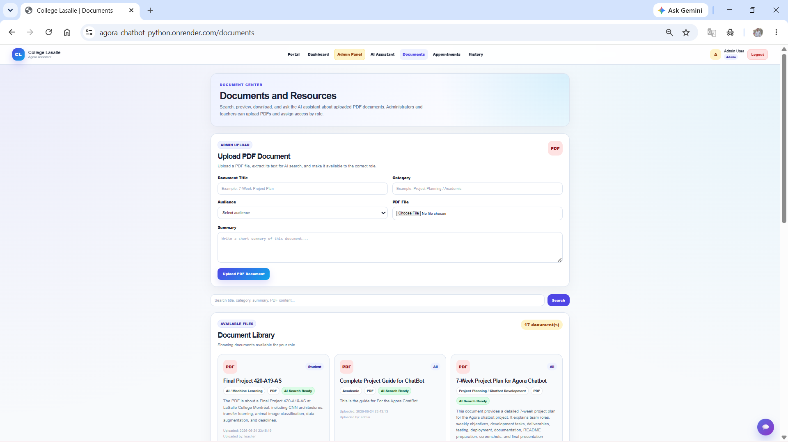

### PDF Preview

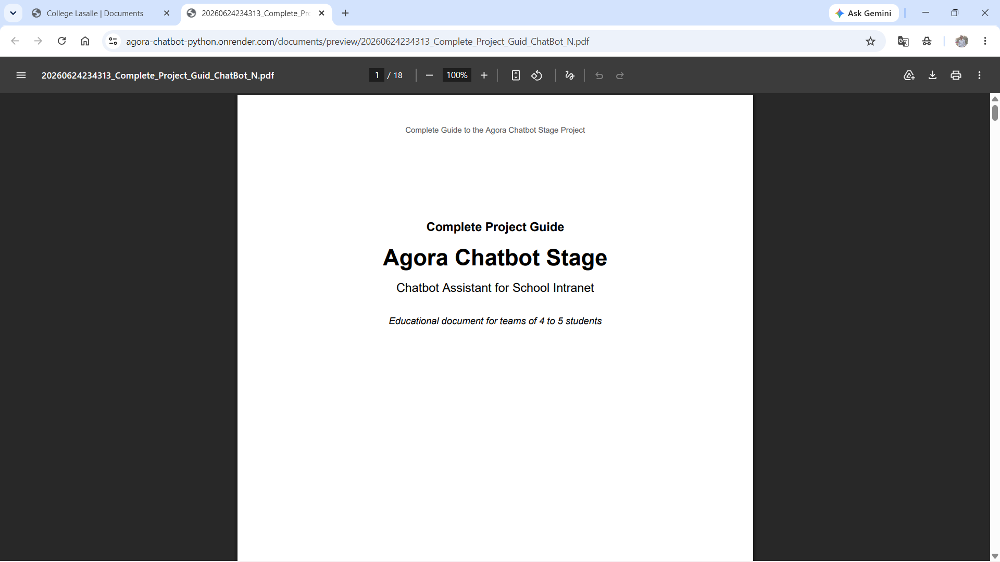

### Appointment Page

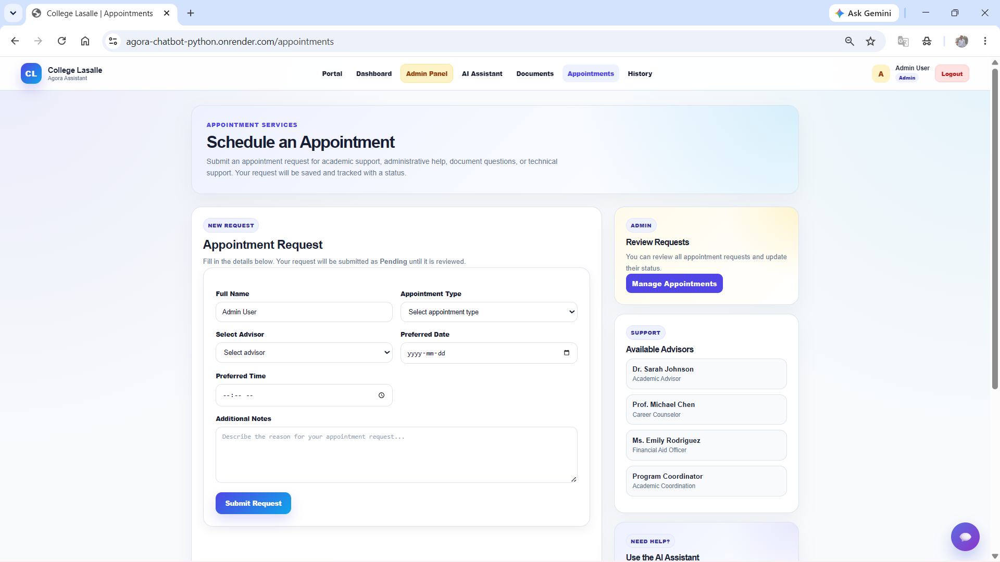

### Admin Appointment Management

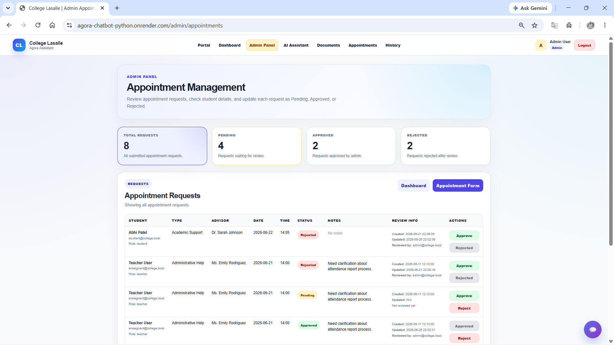

### Conversation History

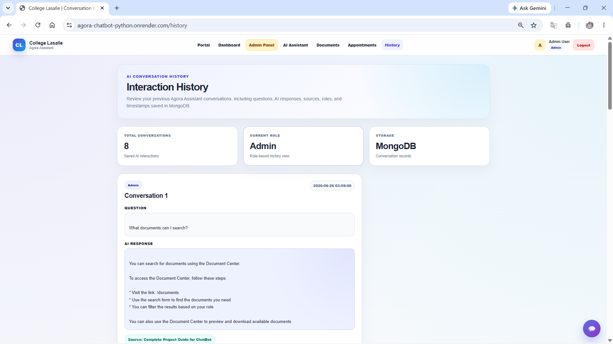

### MongoDB Collections

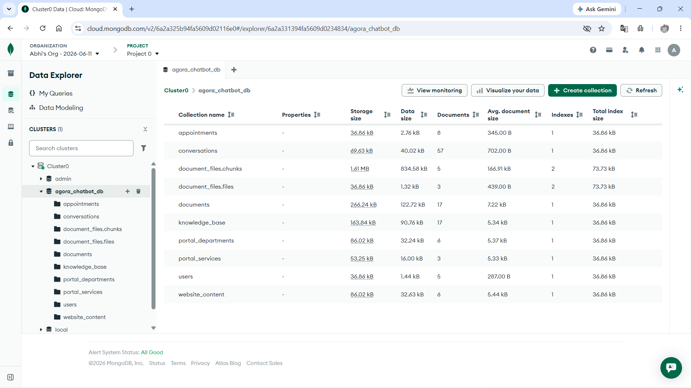

### Render Deployment

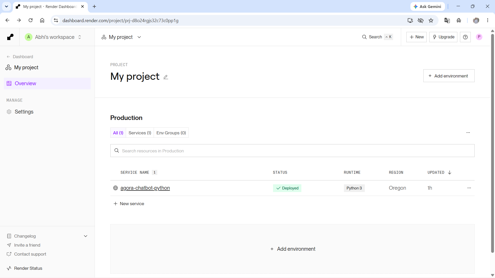

---

## Main Features

### 1. AI Campus Portal

The application includes a modern campus portal interface after login.

Portal features:

* Welcome dashboard
* Embedded chatbot widget
* Service cards
* Department section
* Document section
* Quick action buttons
* Navigation links
* Responsive layout
* Role-aware user experience

The portal works as the main entry point for users and connects all modules of the application.

---

### 2. Authentication System

The system includes session-based authentication to protect private pages.

Implemented features:

* User login
* Logout functionality
* Protected Flask routes
* Session-based access control
* Role-based content access
* Student, teacher, and administrator roles
* Secure password verification
* Automatic upgrade from old plain-text demo passwords to hashed passwords

Supported roles:

| Role          | Main Access                                                    |
| ------------- | -------------------------------------------------------------- |
| Student       | Chatbot, documents, appointments, history                      |
| Teacher       | Chatbot, documents, PDF upload, appointments                   |
| Administrator | Full access, admin appointment management, document management |

---

### 3. Role-Based Access Control

Different users can access different content based on their role.

Examples:

* Students can view documents intended for students or general users.
* Teachers can upload documents for students or teachers.
* Administrators can view and manage all records.
* Chatbot responses are filtered based on the logged-in user role.

This prevents unauthorized users from accessing information that is not meant for them.

---

## AI Chatbot System

The chatbot is the main intelligent feature of the project.

It can answer:

* Casual greetings
* Portal navigation questions
* Document-related questions
* Appointment-related questions
* Student service questions
* Course registration questions
* Department and service questions
* Questions about uploaded PDF content

Example casual messages:

```text
hi
hello
how are you
thanks
bye
who are you
what can you do
```

Example institutional questions:

```text
Which courses are offered?
How can students register for courses?
How can I book an academic advisor appointment?
Where can I find the document center?
What services are available?
Where can students get support?
```

The chatbot uses this response process:

```text
User question
↓
Casual conversation check
↓
Question tokenization
↓
Optimized MongoDB retrieval
↓
Role-based filtering
↓
Relevant context selection
↓
Groq AI prompt
↓
Final answer
↓
Conversation saved in MongoDB
```

The chatbot is also designed with strict guardrails. It is instructed to use only the retrieved database context. If the answer is not found, it must reply:

```text
I cannot find this information in the database.
```

---

## Optimized MongoDB Retrieval

The deployed chatbot uses optimized standard MongoDB retrieval instead of heavy runtime embedding models.

The retrieval system includes:

* Question tokenization
* Stop-word removal
* Stable token ordering
* Basic plural handling
* MongoDB regex filtering
* Weighted field scoring
* Role-based access filtering
* Multi-field context extraction
* Candidate result limits
* Strict AI response guardrails

The chatbot searches across multiple MongoDB collections:

```text
knowledge_base
documents
website_content
portal_services
portal_departments
```

Searchable fields include:

```text
title
category
keywords
answer
summary
text
content
description
content_text
file_name
original_file_name
```

This design improves chatbot accuracy compared to simple raw string matching while remaining lightweight enough for Render free deployment.

---

## Why Vector Search Is a Future Improvement

Vector Search and transformer-based embeddings were explored during development. However, deploying heavy embedding libraries on Render Free caused memory issues because the free plan has a limited memory environment.

Heavy packages such as the following can exceed Render Free memory limits:

```text
sentence-transformers
torch
tensorflow
transformers
```

Because of this, the final deployed version uses optimized standard MongoDB retrieval instead of runtime transformer embeddings.

Final deployed design:

* No heavy ML model is loaded at Flask startup.
* No transformer embedding package is required in production.
* MongoDB regex filtering is used for efficient candidate search.
* Tokenized scoring ranks the most relevant results.
* Groq AI generates answers only from retrieved database context.
* The app stays compatible with Render free hosting.

Vector Search remains a strong future improvement for a higher-memory deployment environment.

Future Vector Search upgrade options:

* MongoDB Atlas Vector Search
* OpenAI embeddings
* SentenceTransformers
* Voyage embeddings
* Cohere embeddings
* Dedicated embedding microservice
* Paid Render instance or another higher-memory hosting platform

---

## Chatbot Retrieval Problems Fixed

Several important chatbot retrieval issues were identified and fixed.

### 1. Inverted Search Logic

Old issue:

```text
The chatbot checked whether a full document title existed inside the user's short question.
```

Example problem:

```text
Question: Which courses are offered?
Document title: Course Registration Guide for Students
```

The old logic checked whether the entire title existed inside the short question, which usually returned false.

Fix:

```text
The question is tokenized into meaningful words and compared against searchable database fields.
```

Now the chatbot can correctly match words like:

```text
course
registration
student
advisor
appointment
document
```

---

### 2. Naive Non-Tokenized Scoring

Old issue:

```text
The chatbot used raw string matching instead of token-based scoring.
```

This caused poor results when users asked questions using different wording.

Fix:

* Tokenized question processing
* Stop-word removal
* Basic plural handling
* Weighted field scoring
* Stable token ordering
* Better matching across title, keywords, summary, answer, content, and PDF text

---

### 3. Brute Force Database Scanning

Old issue:

```text
The chatbot loaded entire MongoDB collections into memory for every message request.
```

This was inefficient and risky for deployment.

Fix:

* MongoDB-side filtering
* MongoDB regex queries
* Candidate result limits
* Search tokens extracted before querying
* Fallback result filtering

This reduces unnecessary memory usage and keeps the deployed version more stable.

---

### 4. Context Field Mismatch

Old issue:

```text
The chatbot expected only the answer field.
```

However, imported data and PDF records may use different fields.

Fix:

The chatbot now checks multiple possible content fields:

```text
answer
text
summary
content
description
content_text
```

This makes the system more flexible and allows it to work with knowledge base records, website content, uploaded documents, and PDF text.

---

### 5. LLM Guardrails

Old issue:

```text
The AI could generate unsupported answers if the retrieved context was empty.
```

Fix:

The Groq prompt now includes strict instructions:

* Use only the database context.
* Do not guess.
* Do not invent policies, courses, schedules, services, or documents.
* If the answer is not in the context, reply exactly:

```text
I cannot find this information in the database.
```

---

### 6. Deployment-Safe Search Decision

Vector Search with embeddings was explored, but the live deployment uses optimized MongoDB retrieval because heavy embedding libraries exceeded the Render free memory limit.

This decision keeps the project stable, deployable, and practical for the final demonstration.

---

## Embedded Chatbot Widget

The project includes a floating chatbot widget inside the demo portal website.

Widget features:

* Floating chatbot button
* Chat window inside the portal page
* Quick action buttons
* Chatbot responses with source information
* Suggested navigation buttons
* Links to documents, appointments, services, departments, and history
* Separate API route for widget messages

The widget makes the chatbot accessible without leaving the portal page.

---

## Document Center and PDF Storage

The document center allows users to view, search, preview, upload, and download institutional PDF resources.

Implemented features:

* Role-based document visibility
* Search by title
* Search by category
* Search by summary
* Search by file name
* Search by extracted PDF text
* Document cards
* Category sidebar
* PDF preview
* PDF download
* PDF upload for teachers and administrators
* MongoDB GridFS file storage
* Extracted PDF text stored in MongoDB
* Orphan GridFS cleanup if metadata insertion fails

PDF metadata is stored in:

```text
documents
```

PDF file bytes are stored in GridFS collections:

```text
document_files.files
document_files.chunks
```

Document examples:

* Course Registration Guide
* Academic Advisor Booking Guide
* Exam Retake Form
* Student forms
* Academic resources
* Administrative documents

---

## Appointment Management

The appointment module allows users to submit appointment requests through the portal.

Implemented features:

* Appointment booking form
* Appointment type selection
* Advisor selection
* Date selection
* Time selection
* Notes field
* MongoDB appointment storage
* Pending appointment status
* Admin appointment review
* Admin approval workflow
* Admin rejection workflow

Supported appointment types:

* Academic advising
* Administrative support
* Student services
* Program consultation
* Technical support

Appointment status values:

```text
Pending
Approved
Rejected
```

Important note:

```text
The application saves appointment requests as Pending.
Email confirmation is not currently implemented.
```

The chatbot is specifically instructed not to promise email confirmations or automatic notifications.

---

## Conversation History

The application stores chatbot conversations in MongoDB Atlas.

Stored fields include:

* User name
* User email
* User role
* Question
* Answer
* Source
* Module
* Timestamp

This allows users to review previous chatbot interactions and supports future analytics.

---

## REST API Endpoints

The application includes REST API routes for chatbot, widget, documents, appointments, history, and admin actions.

| Method | Endpoint                                          | Description                                    |
| ------ | ------------------------------------------------- | ---------------------------------------------- |
| GET    | `/health`                                         | Health check endpoint                          |
| POST   | `/api/chat/message`                               | Sends a message to the full chatbot page       |
| POST   | `/api/widget/message`                             | Sends a message to the embedded chatbot widget |
| GET    | `/api/chat/history`                               | Returns logged-in user's chatbot history       |
| GET    | `/api/documents`                                  | Returns role-accessible documents              |
| GET    | `/api/appointments`                               | Returns logged-in user's appointments          |
| POST   | `/api/appointments`                               | Creates an appointment request                 |
| POST   | `/api/admin/appointments/<appointment_id>/status` | Updates appointment status                     |

---

## Technology Stack

### Frontend

* HTML5
* CSS3
* JavaScript
* Jinja2 templates

### Backend

* Python
* Flask
* Werkzeug Security
* pypdf

### Database and Storage

* MongoDB Atlas
* PyMongo
* MongoDB GridFS

### AI and Search

* Groq API
* Llama 3.1 Instant model
* Optimized MongoDB retrieval
* MongoDB regex search
* Tokenized relevance scoring
* Multi-field context extraction
* Strict AI guardrails

### Deployment

* Render
* Gunicorn
* GitHub

### Development Tools

* Visual Studio Code
* Git
* GitHub
* MongoDB Atlas
* Postman
* Python virtual environment

---

## System Architecture

```text
┌──────────────────────────────┐
│            User              │
└──────────────┬───────────────┘
               │
               ▼
┌──────────────────────────────┐
│      Flask Web Interface     │
│ Login / Portal / Dashboard   │
└──────────────┬───────────────┘
               │
               ▼
┌──────────────────────────────┐
│    Authentication Layer      │
│ Sessions + Role Checking     │
└──────────────┬───────────────┘
               │
               ▼
┌──────────────────────────────┐
│      Application Modules     │
│ Chat / Docs / Appointments   │
└──────────────┬───────────────┘
               │
               ▼
┌──────────────────────────────┐
│      Chatbot Service Layer   │
│ Token Search + Regex Search  │
│ Relevance Scoring + Guardrails│
└──────────────┬───────────────┘
               │
               ▼
┌──────────────────────────────┐
│        MongoDB Atlas         │
│ Collections + GridFS Storage │
└──────────────┬───────────────┘
               │
               ▼
┌──────────────────────────────┐
│          Groq AI API         │
│ Context-Based AI Response    │
└──────────────┬───────────────┘
               │
               ▼
┌──────────────────────────────┐
│    Response Returned to User │
└──────────────────────────────┘
```

---

## Chatbot Workflow

```text
User Question
↓
Check if message is casual conversation
↓
Tokenize user question
↓
Remove stop words
↓
Build MongoDB regex query
↓
Retrieve limited candidate records
↓
Apply role-based access filtering
↓
Calculate relevance score
↓
Extract content from multiple fields
↓
Deduplicate and rank results
↓
Build strict database context
↓
Send context to Groq AI
↓
Generate response from context only
↓
Clean unsupported claims
↓
Save conversation in MongoDB
↓
Return answer and source to user
```

The chatbot is designed to avoid unsupported answers. It retrieves data first, then generates a response only from the retrieved context.

---

## MongoDB Database Structure

Database name:

```text
agora_chatbot_db
```

Collections used:

```text
users
knowledge_base
documents
appointments
conversations
website_content
portal_services
portal_departments
document_files.files
document_files.chunks
```

| Collection              | Purpose                                                                         |
| ----------------------- | ------------------------------------------------------------------------------- |
| `users`                 | Stores user accounts, roles, departments, and password hashes                   |
| `knowledge_base`        | Stores chatbot knowledge records                                                |
| `documents`             | Stores document metadata, extracted PDF text, links, and GridFS file references |
| `appointments`          | Stores appointment requests and statuses                                        |
| `conversations`         | Stores chatbot interaction history                                              |
| `website_content`       | Stores portal page information                                                  |
| `portal_services`       | Stores service information                                                      |
| `portal_departments`    | Stores department information                                                   |
| `document_files.files`  | Stores GridFS PDF file metadata                                                 |
| `document_files.chunks` | Stores GridFS PDF binary chunks                                                 |

---

## Project Folder Structure

```text
agora_chatbot_python/
│
├── app.py
├── mongo_db.py
├── requirements.txt
├── Procfile
├── runtime.txt
├── .env.example
├── .gitignore
├── README.md
│
├── services/
│   ├── ai_service.py
│   └── chatbot_service.py
│
├── templates/
│   ├── base.html
│   ├── login.html
│   ├── dashboard.html
│   ├── demo_site.html
│   ├── chat.html
│   ├── documents.html
│   ├── appointments.html
│   ├── admin_appointments.html
│   ├── history.html
│   ├── 404.html
│   └── 500.html
│
├── static/
│   ├── style.css
│   └── widget/
│       ├── widget.css
│       └── widget.js
│
└── docs/
    └── screenshots/
        ├── login.png
        ├── demo-portal.png
        ├── dashboard.png
        ├── chatbot-page.png
        ├── chatbot-widget.png
        ├── document-center.png
        ├── pdf-preview.png
        ├── appointments.png
        ├── admin-appointments.png
        ├── conversation-history.png
        ├── mongodb-collections.png
        └── render-deployment.png
```

---

## Sprint Progress

### Sprint 1 – Planning

Completed:

* Project scope definition
* Requirement analysis
* Initial architecture planning
* Team role understanding
* Technology selection
* Python equivalent project direction

---

### Sprint 2 – Foundation Development

Completed:

* Flask project setup
* Initial templates
* Login planning
* Knowledge-base structure
* Basic project architecture
* Initial documentation
* Local testing setup

---

### Sprint 3 – MVP Development

Completed:

* Login system
* Dashboard page
* Chatbot page
* Document library
* Appointment form
* Conversation history
* Initial local data handling
* Manual testing

---

### Sprint 4 – Advanced Features

Completed:

* MongoDB Atlas integration
* Groq AI integration
* Role-based chatbot retrieval
* Advanced chatbot service layer
* API improvements
* Expanded data collections
* Professional portal UI
* Website content retrieval
* Embedded chatbot planning

---

### Sprint 5 – Testing and Stabilization

Completed:

* UI improvements
* Embedded chatbot widget
* Custom 404 and 500 error pages
* Document layout fixes
* Casual conversation handling
* Chatbot action buttons
* Testing and bug fixes
* Deployment preparation

---

### Final Enhancement – Retrieval Optimization and Deployment Stabilization

Completed:

* Fixed inverted chatbot search logic
* Added tokenized scoring
* Added MongoDB regex filtering
* Removed inefficient chatbot full collection scanning
* Added multi-field context extraction
* Added strict Groq guardrails
* Added MongoDB GridFS PDF storage
* Added PDF text extraction
* Added role-based document filtering
* Added appointment status management
* Added regex fallback for reliability
* Optimized deployment by removing heavy ML dependencies from the live Render version

---

## Installation Guide

### 1. Clone the Repository

```bash
git clone https://github.com/Abhiptl13/agora-chatbot-python.git
cd agora-chatbot-python
```

### 2. Create a Virtual Environment

```bash
python -m venv venv
```

Activate the virtual environment.

Windows:

```bash
venv\Scripts\activate
```

macOS / Linux:

```bash
source venv/bin/activate
```

### 3. Install Dependencies

```bash
pip install -r requirements.txt
```

### 4. Create Environment File

Create a file named `.env`.

```env
MONGO_URI=your_mongodb_atlas_connection_string
MONGO_DB_NAME=agora_chatbot_db
GROQ_API_KEY=your_groq_api_key
GROQ_MODEL=llama-3.1-8b-instant
SECRET_KEY=your_secret_key
FLASK_DEBUG=0
```

Do not upload `.env` to GitHub.

### 5. Run the Application

```bash
python app.py
```

Open in browser:

```text
http://127.0.0.1:5000
```

---

## Environment Variables

| Variable        | Purpose                                 |
| --------------- | --------------------------------------- |
| `MONGO_URI`     | MongoDB Atlas connection string         |
| `MONGO_DB_NAME` | MongoDB database name                   |
| `GROQ_API_KEY`  | Groq API key for AI response generation |
| `GROQ_MODEL`    | Groq model name                         |
| `SECRET_KEY`    | Flask session secret key                |
| `FLASK_DEBUG`   | Enables or disables Flask debug mode    |

Example `.env.example`:

```env
MONGO_URI=your_mongodb_atlas_connection_string
MONGO_DB_NAME=agora_chatbot_db
GROQ_API_KEY=your_groq_api_key
GROQ_MODEL=llama-3.1-8b-instant
SECRET_KEY=your_secret_key
FLASK_DEBUG=0
```

---

## requirements.txt

Deployment-safe dependencies:

```txt
Flask
pymongo
python-dotenv
groq
gunicorn
pypdf
Werkzeug
```

Do not include these heavy ML packages on Render Free:

```txt
sentence-transformers
torch
tensorflow
transformers
```

These packages can exceed the Render free plan memory limit.

---

## Procfile

```text
web: gunicorn app:app
```

---

## runtime.txt

```text
python-3.11.9
```

---

## .gitignore

Recommended `.gitignore`:

```text
.env
venv/
__pycache__/
*.pyc
instance/
.pytest_cache/
.DS_Store
```

---

## Deployment Guide

The project is deployed using Render.

### Render Settings

```text
Environment: Python
Build Command: pip install -r requirements.txt
Start Command: gunicorn app:app
Plan: Free
```

### Required Render Environment Variables

```text
MONGO_URI
MONGO_DB_NAME
GROQ_API_KEY
GROQ_MODEL
SECRET_KEY
FLASK_DEBUG
```

### MongoDB Atlas Network Access

For demo deployment, allow external access:

```text
0.0.0.0/0
```

For production, restrict access to trusted IP addresses only.

---

## API Examples

### Health Check

```http
GET /health
```

Expected response:

```json
{
  "status": "running",
  "project": "Agora Assistant Chatbot - Python Version",
  "database": "MongoDB Atlas",
  "file_storage": "MongoDB GridFS",
  "ai_provider": "Groq API",
  "search_mode": "Optimized MongoDB Retrieval"
}
```

### Chat Message

```http
POST /api/chat/message
```

Example body:

```json
{
  "message": "Which courses are offered?"
}
```

Expected response:

```json
{
  "question": "Which courses are offered?",
  "answer": "Students can complete course registration through the Agora intranet registration section.",
  "source": "Course Registration",
  "matched": true
}
```

### Widget Chat Message

```http
POST /api/widget/message
```

Example body:

```json
{
  "message": "How can I book an appointment?"
}
```

Expected response:

```json
{
  "question": "How can I book an appointment?",
  "answer": "You can book an appointment through the appointment page.",
  "source": "Academic Advisor Booking Guide",
  "matched": true,
  "module": "embedded_widget"
}
```

---

## Testing Checklist

Before final submission or deployment, test the following:

```text
Login page loads
Login redirects to /demo-site
Demo portal opens correctly
Embedded chatbot opens
Chatbot answers casual messages
Chatbot answers institutional questions
Chatbot uses optimized MongoDB retrieval
Chatbot fallback works
Chatbot action buttons work
Dashboard opens
Documents page layout works
Document search works
PDF upload works
PDF preview works
PDF download works
Appointment page works
Appointment form submits
Admin appointment page opens
Admin can approve appointment
Admin can reject appointment
History page displays conversations
404 page works
500 page exists
API health endpoint works
MongoDB connection works
GridFS file storage works
Groq AI response works
Render deployment works
Screenshots are added to docs/screenshots
```

---

## Security Features

Implemented security features:

* Session-based authentication
* Protected routes
* Role-based content filtering
* Environment variable protection
* MongoDB Atlas authentication
* API keys stored outside source code
* `.env` excluded from GitHub
* Password hashing with Werkzeug
* Automatic password upgrade for old plain-text demo passwords
* Custom error pages
* File upload restricted to PDFs
* Maximum upload size limit
* Secure filename handling
* Role-based document access

Future security improvements:

* CSRF protection
* Multi-factor authentication
* Audit logs
* More advanced role permissions
* Stronger PDF content validation

---

## Known Limitations

Current limitations:

* Email confirmations for appointments are not implemented.
* Public self-registration is not enabled.
* Admin-created or seeded accounts are required.
* Free Render deployment may sleep after inactivity.
* Scanned image-only PDFs may not be searchable unless OCR is added in the future.
* Vector Search is not enabled in the deployed Render Free version because heavy embedding libraries can exceed the free plan memory limit.

---

## Future Improvements

Possible future enhancements:

* Email notifications for appointments
* OCR for scanned PDFs
* Admin user-management page
* CSRF protection
* Audit logs
* Advanced analytics dashboard
* Multilingual chatbot support
* User profile management
* MongoDB Atlas Vector Search after upgrading hosting resources
* Production-grade embeddings using OpenAI, SentenceTransformers, Voyage, Cohere, or another embedding provider
* More advanced AI prompt monitoring and evaluation

---

## Project Status

```text
Development: Completed
Testing: Completed
Optimized MongoDB Retrieval: Completed
PDF Upload and GridFS Storage: Completed
Render Deployment: Completed
Final Documentation: Completed
Vector Search: Future Improvement
```

---

## Author

```text
Abhi Ketankumar Patel
Student ID: 2431401
Internship Project – LCI LX Studio Inc.
Python-Based Equivalent Version
College Lasalle – AI and ML Internship Project
```

---

## Conclusion

The Agora Assistant Chatbot demonstrates a complete Python-based intelligent assistant platform for a College Lasalle-style intranet environment.

The project combines Flask backend development, MongoDB Atlas cloud storage, MongoDB GridFS PDF storage, Groq AI response generation, optimized MongoDB retrieval, role-based access, document search, appointment management, embedded chatbot functionality, and professional user interface design.

The final system provides a strong foundation for a realistic institutional assistant and can be expanded in the future with email notifications, OCR, multilingual support, analytics, stronger security, MongoDB Atlas Vector Search, and production-grade embedding models.
