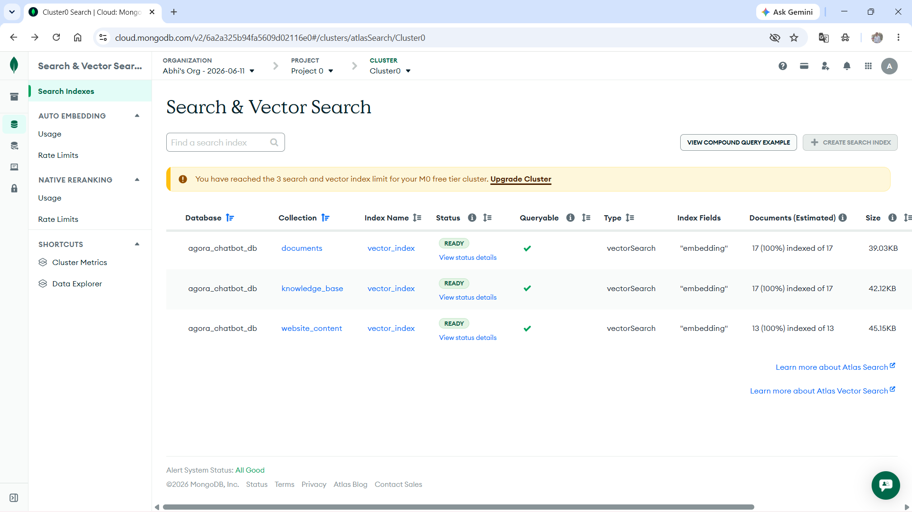

# Agora Assistant Chatbot – Python Intelligent Campus Assistant


A Python-based intelligent campus assistant built with Flask, MongoDB Atlas, MongoDB GridFS, Groq AI, MongoDB Atlas Vector Search, and optimized MongoDB retrieval fallback. The application provides a College Lasalle-style intranet portal where students, teachers, and administrators can access documents, book appointments, use an AI chatbot, view conversation history, and interact with an embedded chatbot widget.

This project was developed as the Python-based equivalent version of the main Agora Assistant Chatbot project. It focuses on backend logic, AI-assisted retrieval, role-based access, document management, PDF storage, chatbot reliability, dynamic chatbot actions, website-content retrieval, and deployment-ready architecture.

The current version uses a hybrid retrieval system:

```text
MongoDB Atlas Vector Search
+
Optimized MongoDB regex fallback
+
Structured MongoDB direct queries
+
Groq AI response generation
```

Vector Search is configured for the main retrieval collections:

```text
documents
knowledge_base
website_content
```

The following smaller structured collections use optimized MongoDB fallback retrieval:

```text
portal_services
portal_departments
```

This keeps the system practical, accurate, and cost-aware while still demonstrating real semantic search on the most important chatbot data sources.

---

## Table of Contents

* [Live Deployment](#live-deployment)
* [Project Overview](#project-overview)
* [Screenshots](#screenshots)
* [Main Features](#main-features)
* [AI Chatbot System](#ai-chatbot-system)
* [MongoDB Atlas Vector Search](#mongodb-atlas-vector-search)
* [Optimized MongoDB Retrieval Fallback](#optimized-mongodb-retrieval-fallback)
* [Website Content Retrieval](#website-content-retrieval)
* [Dynamic Chatbot Actions](#dynamic-chatbot-actions)
* [Chatbot Retrieval Problems Fixed](#chatbot-retrieval-problems-fixed)
* [Embedded Chatbot Widget](#embedded-chatbot-widget)
* [Document Center and PDF Storage](#document-center-and-pdf-storage)
* [Appointment Management](#appointment-management)
* [Conversation History](#conversation-history)
* [REST API Endpoints](#rest-api-endpoints)
* [Technology Stack](#technology-stack)
* [System Architecture](#system-architecture)
* [Chatbot Workflow](#chatbot-workflow)
* [MongoDB Database Structure](#mongodb-database-structure)
* [Project Folder Structure](#project-folder-structure)
* [Sprint Progress](#sprint-progress)
* [Installation Guide](#installation-guide)
* [Environment Variables](#environment-variables)
* [Vector Search Setup](#vector-search-setup)
* [Deployment Guide](#deployment-guide)
* [API Examples](#api-examples)
* [Testing Checklist](#testing-checklist)
* [Security Features](#security-features)
* [Known Limitations](#known-limitations)
* [Future Improvements](#future-improvements)
* [Project Status](#project-status)
* [Author](#author)
* [Conclusion](#conclusion)

---

## Live Deployment

The project is designed for deployment on Render.

```text
https://agora-chatbot-python.onrender.com
```

Login page:

```text
https://agora-chatbot-python.onrender.com/login
```

Health check:

```text
https://agora-chatbot-python.onrender.com/health
```

---

## Project Overview

The Agora Assistant Chatbot is a Python-based intelligent assistant platform designed for a College Lasalle-style intranet environment. It helps students, teachers, and administrators access institutional information through a centralized web portal.

The system combines:

* Flask web application
* MongoDB Atlas cloud database
* MongoDB GridFS PDF file storage
* MongoDB Atlas Vector Search
* Local SentenceTransformer embeddings
* Groq AI response generation
* Optimized MongoDB fallback retrieval
* Structured MongoDB direct queries
* Role-based access control
* Appointment request workflow
* Conversation history tracking
* Embedded chatbot widget
* Dynamic chatbot action buttons
* Website content synchronization
* Render deployment support

The chatbot does not simply answer from general knowledge. It first retrieves relevant context from MongoDB using Vector Search or fallback retrieval, then sends that context to Groq AI. If the database context does not contain the answer, the chatbot is instructed to clearly respond that the information cannot be found in the database.

This approach improves reliability, reduces unsupported AI-generated answers, and demonstrates a realistic retrieval-augmented chatbot pipeline.

---

## Screenshots

Screenshots are included to demonstrate the final working system.

Create this folder:

```text
docs/screenshots/
```

### Login Page


### Demo Portal


### Dashboard


### Chatbot Page


### Embedded Chatbot Widget


### Document Center


### PDF Preview


### Appointment Page


### Admin Appointment Management


### Conversation History


### MongoDB Collections


### MongoDB Vector Search Indexes



### Render Deployment


---

## Main Features

### 1. AI Campus Portal

The application includes a modern campus portal interface after login.

Portal features:

* Welcome dashboard
* Embedded chatbot widget
* Service cards
* Department section
* Document section
* Quick action buttons
* Navigation links
* Responsive layout
* Role-aware user experience

The portal works as the main entry point for users and connects all modules of the application.

---

### 2. Authentication System

The system includes session-based authentication to protect private pages.

Implemented features:

* User login
* Logout functionality
* Protected Flask routes
* Session-based access control
* Role-based content access
* Student, teacher, and administrator roles
* Secure password verification
* Automatic upgrade from old plain-text demo passwords to hashed passwords

Supported roles:

| Role          | Main Access                                                    |
| ------------- | -------------------------------------------------------------- |
| Student       | Chatbot, documents, appointments, history                      |
| Teacher       | Chatbot, documents, PDF upload, appointments                   |
| Administrator | Full access, admin appointment management, document management |

---

### 3. Role-Based Access Control

Different users can access different content based on their role.

Examples:

* Students can view documents intended for students or general users.
* Teachers can upload documents for students or teachers.
* Administrators can view and manage all records.
* Chatbot responses are filtered based on the logged-in user role.

This prevents unauthorized users from accessing information that is not meant for them.

---

## AI Chatbot System

The chatbot is the main intelligent feature of the project.

It can answer:

* Casual greetings
* Portal navigation questions
* Document-related questions
* Appointment-related questions
* Student service questions
* Course registration questions
* Department and service questions
* Questions about uploaded PDF content
* Questions based on synced website content

Example casual messages:

```text
hi
hello
how are you
thanks
bye
who are you
what can you do
```

Example institutional questions:

```text
Which courses are offered?
How can students register for courses?
How can I book an academic advisor appointment?
Where can I find the document center?
What services are available?
Where can students get support?
What departments are available?
```

The chatbot uses this response process:

```text
User question
↓
Casual conversation check
↓
Structured-query intent check
↓
Vector Search retrieval
↓
Optimized MongoDB fallback retrieval
↓
Role-based filtering
↓
Relevant context selection
↓
Groq AI prompt
↓
Final answer
↓
Dynamic action button
↓
Conversation saved in MongoDB
```

The chatbot is also designed with strict guardrails. It is instructed to use only the retrieved database context. If the answer is not found, it must reply:

```text
I cannot find this information in the database.
```

---

## MongoDB Atlas Vector Search

The current system supports real MongoDB Atlas Vector Search.

Vector Search is configured for the main retrieval collections:

```text
documents
knowledge_base
website_content
```

These are the most important semantic-search sources because they contain uploaded PDFs, institutional knowledge records, and portal page content.

The Vector Search setup uses:

```text
Index name: vector_index
Vector field: embedding
Dimensions: 384
Similarity: cosine
```

Embedding model:

```text
sentence-transformers/all-MiniLM-L6-v2
```

The chatbot creates an embedding from the user's question, sends it to MongoDB Atlas `$vectorSearch`, retrieves the most relevant database records, and then sends the retrieved context to Groq AI.

Vector Search flow:

```text
User Question
↓
SentenceTransformer embedding
↓
MongoDB Atlas $vectorSearch
↓
Relevant MongoDB records
↓
Groq AI answer from context
↓
Action button returned to frontend
```

Example health route response:

```json
{
  "status": "running",
  "project": "Agora Assistant Chatbot - Python Version",
  "database": "MongoDB Atlas",
  "file_storage": "MongoDB GridFS",
  "ai_provider": "Groq API",
  "search_mode": "MongoDB Atlas Vector Search + Optimized MongoDB Retrieval Fallback",
  "embedding_model": "sentence-transformers/all-MiniLM-L6-v2",
  "embedding_dimensions": 384,
  "embedding_service_available": true,
  "vector_search_supported": true,
  "website_content_sync_available": true
}
```

### Vector Search Coverage

| Collection           | Retrieval Method                                      |
| -------------------- | ----------------------------------------------------- |
| `documents`          | MongoDB Atlas Vector Search + optimized fallback      |
| `knowledge_base`     | MongoDB Atlas Vector Search + optimized fallback      |
| `website_content`    | MongoDB Atlas Vector Search + optimized fallback      |
| `portal_services`    | Optimized MongoDB fallback retrieval                  |
| `portal_departments` | Optimized MongoDB fallback retrieval                  |

This design avoids unnecessary cost because `portal_services` and `portal_departments` are smaller structured collections and do not require separate Vector Search indexes.

---

## Optimized MongoDB Retrieval Fallback

The chatbot also includes a reliable fallback search system.

The fallback retrieval system includes:

* Question tokenization
* Stop-word removal
* Stable token ordering
* Basic plural handling
* MongoDB regex filtering
* Weighted field scoring
* Role-based access filtering
* Multi-field context extraction
* Candidate result limits
* Strict AI response guardrails

The fallback searches across multiple MongoDB collections:

```text
knowledge_base
documents
website_content
portal_services
portal_departments
```

Searchable fields include:

```text
title
category
keywords
answer
summary
text
content
description
content_text
file_name
original_file_name
```

This fallback keeps the chatbot functional even if:

```text
A Vector Search index is missing
An embedding is not available
MongoDB Atlas Vector Search returns no match
The deployment environment has limited memory
A smaller structured collection does not need Vector Search
```

---

## Website Content Retrieval

The project includes a website-content synchronization service.

It scans local Flask templates and creates searchable MongoDB records for portal pages, services, and departments.

Synced collections:

```text
website_content
portal_services
portal_departments
```

Examples of synced portal pages:

```text
Dashboard
Chatbot page
Document center
Appointment page
Conversation history
Admin appointment management
Demo portal
```

Examples of synced services:

```text
Document Center
Appointment Booking
AI Assistant
Conversation History
Admin Appointment Review
```

Examples of synced departments:

```text
Computer Science and AI
Student Services
Academic Advising
Administration
```

This allows the chatbot to answer questions about the real portal instead of only static internal knowledge records.

Website content sync command:

```bash
python -c "from services.website_content_sync_service import sync_website_content_to_mongodb; print(sync_website_content_to_mongodb())"
```

Admin sync route:

```text
/admin/sync-website-content
```

Admin API sync route:

```text
/api/admin/sync-website-content
```

---

## Dynamic Chatbot Actions

The chatbot can now return dynamic action buttons together with the answer.

Backend response fields:

```text
answer
source
matched
action_label
action_url
```

Examples:

| User Question                       | Action Button              |
| ----------------------------------- | -------------------------- |
| `How can I book an appointment?`    | Open Appointment Page      |
| `What documents are available?`     | Open Document Center       |
| `Show my appointments`              | View My Appointments       |
| `What services are available?`      | Open Portal Services       |
| `Open conversation history`         | Open Conversation History  |

The frontend chatbot page and embedded widget both read `action_label` and `action_url` from the backend response. If the backend does not return an action, the frontend can still use safe fallback action suggestions.

This connects the chatbot to actual application behavior instead of only text-based answers.

---

## Chatbot Retrieval Problems Fixed

Several important chatbot retrieval issues were identified and fixed.

### 1. Inverted Search Logic

Old issue:

```text
The chatbot checked whether a full document title existed inside the user's short question.
```

Example problem:

```text
Question: Which courses are offered?
Document title: Course Registration Guide for Students
```

The old logic checked whether the entire title existed inside the short question, which usually returned false.

Fix:

```text
The question is tokenized into meaningful words and compared against searchable database fields.
```

Now the chatbot can correctly match words like:

```text
course
registration
student
advisor
appointment
document
```

---

### 2. Naive Non-Tokenized Scoring

Old issue:

```text
The chatbot used raw string matching instead of token-based scoring.
```

This caused poor results when users asked questions using different wording.

Fix:

* Tokenized question processing
* Stop-word removal
* Basic plural handling
* Weighted field scoring
* Stable token ordering
* Better matching across title, keywords, summary, answer, content, and PDF text

---

### 3. Brute Force Database Scanning

Old issue:

```text
The chatbot loaded entire MongoDB collections into memory for every message request.
```

This was inefficient and risky for deployment.

Fix:

* MongoDB-side filtering
* MongoDB regex queries
* Candidate result limits
* Search tokens extracted before querying
* `.limit()` added to database access functions
* Vector Search for the main semantic collections

This reduces unnecessary memory usage and keeps the application more stable.

---

### 4. Context Field Mismatch

Old issue:

```text
The chatbot expected only the answer field.
```

However, imported data and PDF records may use different fields.

Fix:

The chatbot now checks multiple possible content fields:

```text
answer
text
summary
content
description
content_text
```

This makes the system more flexible and allows it to work with knowledge base records, website content, uploaded documents, and PDF text.

---

### 5. LLM Guardrails

Old issue:

```text
The AI could generate unsupported answers if the retrieved context was empty.
```

Fix:

The Groq prompt now includes strict instructions:

* Use only the database context.
* Do not guess.
* Do not invent policies, courses, schedules, services, or documents.
* If the answer is not in the context, reply exactly:

```text
I cannot find this information in the database.
```

---

### 6. Structured Query Handling

Some questions should not go through AI retrieval because they require direct database actions.

Examples:

```text
Show my appointments
Show available documents
Book appointment
```

Fix:

The chatbot now detects structured intents and queries MongoDB collections directly when appropriate.

This improves reliability for portal actions and user-specific records.

---

## Embedded Chatbot Widget

The project includes a floating chatbot widget inside the demo portal website.

Widget features:

* Floating chatbot button
* Chat window inside the portal page
* Quick action buttons
* Chatbot responses with source information
* Backend dynamic action buttons
* Suggested navigation buttons
* Links to documents, appointments, services, departments, and history
* Separate API route for widget messages

The widget makes the chatbot accessible without leaving the portal page.

---

## Document Center and PDF Storage

The document center allows users to view, search, preview, upload, and download institutional PDF resources.

Implemented features:

* Role-based document visibility
* Search by title
* Search by category
* Search by summary
* Search by file name
* Search by extracted PDF text
* Document cards
* Category sidebar
* PDF preview
* PDF download
* PDF upload for teachers and administrators
* MongoDB GridFS file storage
* Extracted PDF text stored in MongoDB
* Embeddings stored for semantic document search
* Orphan GridFS cleanup if metadata insertion fails

PDF metadata is stored in:

```text
documents
```

PDF file bytes are stored in GridFS collections:

```text
document_files.files
document_files.chunks
```

Document examples:

* Course Registration Guide
* Academic Advisor Booking Guide
* Exam Retake Form
* Student forms
* Academic resources
* Administrative documents

---

## Appointment Management

The appointment module allows users to submit appointment requests through the portal.

Implemented features:

* Appointment booking form
* Appointment type selection
* Advisor selection
* Date selection
* Time selection
* Notes field
* MongoDB appointment storage
* Pending appointment status
* Admin appointment review
* Admin approval workflow
* Admin rejection workflow
* Direct chatbot appointment lookup
* Dynamic appointment action button

Supported appointment types:

* Academic advising
* Administrative support
* Student services
* Program consultation
* Technical support

Appointment status values:

```text
Pending
Approved
Rejected
```

Important note:

```text
The application saves appointment requests as Pending.
Email confirmation is not currently implemented.
```

The chatbot is specifically instructed not to promise email confirmations or automatic notifications.

---

## Conversation History

The application stores chatbot conversations in MongoDB Atlas.

Stored fields include:

* User name
* User email
* User role
* Question
* Answer
* Source
* Action label
* Action URL
* Module
* Timestamp

This allows users to review previous chatbot interactions and supports future analytics.

---

## REST API Endpoints

The application includes REST API routes for chatbot, widget, documents, appointments, history, website sync, and admin actions.

| Method | Endpoint                                          | Description                                    |
| ------ | ------------------------------------------------- | ---------------------------------------------- |
| GET    | `/health`                                         | Health check endpoint                          |
| POST   | `/api/chat/message`                               | Sends a message to the full chatbot page       |
| POST   | `/api/widget/message`                             | Sends a message to the embedded chatbot widget |
| GET    | `/api/chat/history`                               | Returns logged-in user's chatbot history       |
| GET    | `/api/documents`                                  | Returns role-accessible documents              |
| GET    | `/api/appointments`                               | Returns logged-in user's appointments          |
| POST   | `/api/appointments`                               | Creates an appointment request                 |
| POST   | `/api/admin/appointments/<appointment_id>/status` | Updates appointment status                     |
| GET    | `/admin/sync-website-content`                     | Previews or displays website sync page         |
| POST   | `/admin/sync-website-content`                     | Syncs website content into MongoDB             |
| POST   | `/api/admin/sync-website-content`                 | Syncs website content through API              |

---

## Technology Stack

### Frontend

* HTML5
* CSS3
* JavaScript
* Jinja2 templates

### Backend

* Python
* Flask
* Werkzeug Security
* pypdf

### Database and Storage

* MongoDB Atlas
* PyMongo
* MongoDB GridFS
* MongoDB Atlas Vector Search

### AI and Search

* Groq API
* Llama 3.1 Instant model
* SentenceTransformer embeddings
* `sentence-transformers/all-MiniLM-L6-v2`
* MongoDB Atlas Vector Search
* Optimized MongoDB regex fallback
* Tokenized relevance scoring
* Multi-field context extraction
* Strict AI guardrails

### Deployment

* Render
* Gunicorn
* GitHub

### Development Tools

* Visual Studio Code
* Git
* GitHub
* MongoDB Atlas
* Postman
* Python virtual environment

---

## System Architecture

```text
┌──────────────────────────────┐
│            User              │
└──────────────┬───────────────┘
               │
               ▼
┌──────────────────────────────┐
│      Flask Web Interface     │
│ Login / Portal / Dashboard   │
└──────────────┬───────────────┘
               │
               ▼
┌──────────────────────────────┐
│    Authentication Layer      │
│ Sessions + Role Checking     │
└──────────────┬───────────────┘
               │
               ▼
┌──────────────────────────────┐
│      Application Modules     │
│ Chat / Docs / Appointments   │
└──────────────┬───────────────┘
               │
               ▼
┌──────────────────────────────┐
│      Chatbot Service Layer   │
│ Vector Search + Fallback     │
│ Structured Queries + Actions │
└──────────────┬───────────────┘
               │
               ▼
┌──────────────────────────────┐
│        MongoDB Atlas         │
│ Collections + GridFS Storage │
│ Vector Search Indexes        │
└──────────────┬───────────────┘
               │
               ▼
┌──────────────────────────────┐
│          Groq AI API         │
│ Context-Based AI Response    │
└──────────────┬───────────────┘
               │
               ▼
┌──────────────────────────────┐
│    Dynamic Response to User  │
│ Answer + Source + Action     │
└──────────────────────────────┘
```

---

## Chatbot Workflow

```text
User Question
↓
Check if message is casual conversation
↓
Check if structured query is needed
↓
If structured query is needed, query MongoDB directly
↓
If semantic answer is needed, run Vector Search
↓
Search documents, knowledge_base, and website_content using vector_index
↓
If Vector Search has no result, use optimized MongoDB fallback
↓
Fallback searches all retrieval collections
↓
Apply role-based access filtering
↓
Calculate relevance score
↓
Extract content from multiple fields
↓
Deduplicate and rank results
↓
Build strict database context
↓
Send context to Groq AI
↓
Generate response from context only
↓
Attach action_label and action_url if useful
↓
Save conversation in MongoDB
↓
Return answer, source, matched status, and action button
```

The chatbot is designed to avoid unsupported answers. It retrieves data first, then generates a response only from the retrieved context.

---

## MongoDB Database Structure

Database name:

```text
agora_chatbot_db
```

Collections used:

```text
users
knowledge_base
documents
appointments
conversations
website_content
portal_services
portal_departments
document_files.files
document_files.chunks
```

| Collection              | Purpose                                                                         |
| ----------------------- | ------------------------------------------------------------------------------- |
| `users`                 | Stores user accounts, roles, departments, and password hashes                   |
| `knowledge_base`        | Stores chatbot knowledge records and vector embeddings                          |
| `documents`             | Stores document metadata, extracted PDF text, links, GridFS references, embeddings |
| `appointments`          | Stores appointment requests and statuses                                        |
| `conversations`         | Stores chatbot interaction history                                              |
| `website_content`       | Stores portal page information and vector embeddings                            |
| `portal_services`       | Stores service information                                                      |
| `portal_departments`    | Stores department information                                                   |
| `document_files.files`  | Stores GridFS PDF file metadata                                                 |
| `document_files.chunks` | Stores GridFS PDF binary chunks                                                 |

Embedding fields stored in supported records:

```text
embedding
embedding_model
embedding_dimensions
embedding_created_at
embedding_source
```

---

## Project Folder Structure

```text
agora_chatbot_python/
│
├── app.py
├── mongo_db.py
├── requirements.txt
├── Procfile
├── runtime.txt
├── .env.example
├── .gitignore
├── README.md
│
├── services/
│   ├── ai_service.py
│   ├── chatbot_service.py
│   ├── db_service.py
│   ├── embedding_service.py
│   ├── vector_search_service.py
│   └── website_content_sync_service.py
│
├── scripts/
│   └── backfill_embeddings.py
│
├── templates/
│   ├── base.html
│   ├── login.html
│   ├── dashboard.html
│   ├── demo_site.html
│   ├── chat.html
│   ├── documents.html
│   ├── appointments.html
│   ├── admin_appointments.html
│   ├── history.html
│   ├── 404.html
│   └── 500.html
│
├── static/
│   ├── style.css
│   └── widget/
│       ├── widget.css
│       └── widget.js
│
├── docs/
│   ├── vector_search_setup.md
│   └── screenshots/
│       ├── login.png
│       ├── demo-portal.png
│       ├── dashboard.png
│       ├── chatbot-page.png
│       ├── chatbot-widget.png
│       ├── document-center.png
│       ├── pdf-preview.png
│       ├── appointments.png
│       ├── admin-appointments.png
│       ├── conversation-history.png
│       ├── mongodb-collections.png
│       ├── mongodb-vector-search.png
│       └── render-deployment.png
```

---

## Sprint Progress

### Sprint 1 – Planning

Completed:

* Project scope definition
* Requirement analysis
* Initial architecture planning
* Team role understanding
* Technology selection
* Python equivalent project direction

---

### Sprint 2 – Foundation Development

Completed:

* Flask project setup
* Initial templates
* Login planning
* Knowledge-base structure
* Basic project architecture
* Initial documentation
* Local testing setup

---

### Sprint 3 – MVP Development

Completed:

* Login system
* Dashboard page
* Chatbot page
* Document library
* Appointment form
* Conversation history
* Initial local data handling
* Manual testing

---

### Sprint 4 – Advanced Features

Completed:

* MongoDB Atlas integration
* Groq AI integration
* Role-based chatbot retrieval
* Advanced chatbot service layer
* API improvements
* Expanded data collections
* Professional portal UI
* Website content retrieval
* Embedded chatbot planning

---

### Sprint 5 – Testing and Stabilization

Completed:

* UI improvements
* Embedded chatbot widget
* Custom 404 and 500 error pages
* Document layout fixes
* Casual conversation handling
* Chatbot action buttons
* Testing and bug fixes
* Deployment preparation

---

### Final Enhancement – Vector Search, Website Sync, and Dynamic Actions

Completed:

* Fixed inverted chatbot search logic
* Added tokenized scoring
* Added MongoDB regex filtering
* Removed inefficient chatbot full collection scanning
* Added multi-field context extraction
* Added strict Groq guardrails
* Added MongoDB GridFS PDF storage
* Added PDF text extraction
* Added role-based document filtering
* Added appointment status management
* Added structured MongoDB query handling
* Added MongoDB Atlas Vector Search for main retrieval collections
* Added local SentenceTransformer embedding generation
* Added embedding backfill script
* Added website content synchronization service
* Added dynamic backend action buttons
* Updated chatbot page and embedded widget to use backend actions
* Added regex fallback for reliability

---

## Installation Guide

### 1. Clone the Repository

```bash
git clone https://github.com/Abhiptl13/agora-chatbot-python.git
cd agora-chatbot-python
```

### 2. Create a Virtual Environment

```bash
python -m venv venv
```

Activate the virtual environment.

Windows:

```bash
venv\Scripts\activate
```

macOS / Linux:

```bash
source venv/bin/activate
```

### 3. Install Dependencies

```bash
pip install -r requirements.txt
```

### 4. Create Environment File

Create a file named `.env`.

```env
MONGO_URI=your_mongodb_atlas_connection_string
MONGO_DB_NAME=agora_chatbot_db
GROQ_API_KEY=your_groq_api_key
GROQ_MODEL=llama-3.1-8b-instant
SECRET_KEY=your_secret_key
FLASK_DEBUG=0
EMBEDDING_MODEL_NAME=sentence-transformers/all-MiniLM-L6-v2
EMBEDDING_DIMENSIONS=384
```

Do not upload `.env` to GitHub.

### 5. Run the Application

```bash
python app.py
```

Open in browser:

```text
http://127.0.0.1:5000
```

---

## Environment Variables

| Variable               | Purpose                                  |
| ---------------------- | ---------------------------------------- |
| `MONGO_URI`            | MongoDB Atlas connection string          |
| `MONGO_DB_NAME`        | MongoDB database name                    |
| `GROQ_API_KEY`         | Groq API key for AI response generation  |
| `GROQ_MODEL`           | Groq model name                          |
| `SECRET_KEY`           | Flask session secret key                 |
| `FLASK_DEBUG`          | Enables or disables Flask debug mode     |
| `EMBEDDING_MODEL_NAME` | Local SentenceTransformer embedding model |
| `EMBEDDING_DIMENSIONS` | Embedding vector size                    |

Example `.env.example`:

```env
SECRET_KEY=replace_with_a_secure_secret_key
FLASK_DEBUG=0
PORT=5000

MONGO_URI=replace_with_your_mongodb_atlas_connection_string
MONGO_DB_NAME=agora_chatbot_db

GROQ_API_KEY=replace_with_your_groq_api_key
GROQ_MODEL=llama-3.1-8b-instant

EMBEDDING_MODEL_NAME=sentence-transformers/all-MiniLM-L6-v2
EMBEDDING_DIMENSIONS=384
```

---

## requirements.txt

Recommended dependencies:

```txt
Flask==3.1.3
pymongo==4.17.0
python-dotenv==1.2.2
groq
gunicorn
pypdf
requests
dnspython==2.8.0
Werkzeug==3.1.8
Jinja2==3.1.6
numpy
scikit-learn
sentence-transformers
torch
```

Important deployment note:

```text
sentence-transformers and torch can require more memory than Render Free or Starter.
For stable Vector Search embedding generation, use Render Standard or another higher-memory hosting option.
```

If deploying on a low-memory free plan, keep the optimized MongoDB fallback enabled so the chatbot can still work even if the local embedding model cannot load.

---

## Vector Search Setup

Create a MongoDB Atlas Vector Search index named:

```text
vector_index
```

Create the index on these collections:

```text
documents
knowledge_base
website_content
```

Index JSON:

```json
{
  "fields": [
    {
      "type": "vector",
      "path": "embedding",
      "numDimensions": 384,
      "similarity": "cosine"
    }
  ]
}
```

After creating indexes, sync website content:

```bash
python -c "from services.website_content_sync_service import sync_website_content_to_mongodb; print(sync_website_content_to_mongodb())"
```

Then backfill embeddings:

```bash
python scripts/backfill_embeddings.py
```

Compile check:

```bash
python -m py_compile app.py
python -m py_compile services\chatbot_service.py
python -m py_compile services\db_service.py
python -m py_compile services\embedding_service.py
python -m py_compile services\vector_search_service.py
python -m py_compile services\website_content_sync_service.py
python -m py_compile scripts\backfill_embeddings.py
```

Expected health route result:

```json
{
  "ai_provider": "Groq API",
  "database": "MongoDB Atlas",
  "embedding_dimensions": 384,
  "embedding_model": "sentence-transformers/all-MiniLM-L6-v2",
  "embedding_service_available": true,
  "file_storage": "MongoDB GridFS",
  "project": "Agora Assistant Chatbot - Python Version",
  "search_mode": "MongoDB Atlas Vector Search + Optimized MongoDB Retrieval Fallback",
  "status": "running",
  "vector_search_supported": true,
  "website_content_sync_available": true
}
```

---

## Procfile

```text
web: gunicorn app:app
```

---

## runtime.txt

```text
python-3.11.9
```

---

## .gitignore

Recommended `.gitignore`:

```text
.env
venv/
__pycache__/
*.pyc
instance/
.pytest_cache/
.DS_Store
```

---

## Deployment Guide

The project can be deployed using Render.

### Render Settings

```text
Environment: Python
Build Command: pip install -r requirements.txt
Start Command: gunicorn app:app
Plan: Standard recommended for local embeddings
```

### Required Render Environment Variables

```text
MONGO_URI
MONGO_DB_NAME
GROQ_API_KEY
GROQ_MODEL
SECRET_KEY
FLASK_DEBUG
EMBEDDING_MODEL_NAME
EMBEDDING_DIMENSIONS
```

### MongoDB Atlas Network Access

For demo deployment, allow external access:

```text
0.0.0.0/0
```

For production, restrict access to trusted IP addresses only.

### Deployment Cost Note

The chatbot fallback retrieval works without Vector Search runtime success. However, local embedding generation with `sentence-transformers` and `torch` may require more memory than free hosting provides.

Recommended deployment options:

```text
Render Standard or higher
Higher-memory VPS
Separate embedding microservice
External embedding API
```

---

## API Examples

### Health Check

```http
GET /health
```

Expected response:

```json
{
  "status": "running",
  "project": "Agora Assistant Chatbot - Python Version",
  "database": "MongoDB Atlas",
  "file_storage": "MongoDB GridFS",
  "ai_provider": "Groq API",
  "search_mode": "MongoDB Atlas Vector Search + Optimized MongoDB Retrieval Fallback",
  "embedding_model": "sentence-transformers/all-MiniLM-L6-v2",
  "embedding_dimensions": 384,
  "embedding_service_available": true,
  "vector_search_supported": true,
  "website_content_sync_available": true
}
```

### Chat Message

```http
POST /api/chat/message
```

Example body:

```json
{
  "message": "How can I book an appointment?"
}
```

Expected response:

```json
{
  "question": "How can I book an appointment?",
  "answer": "You can book an appointment from the Appointment Page. Select the appointment type, advisor, date, and time, then submit the request. Your request will be saved as Pending until reviewed.",
  "source": "Appointment Booking",
  "matched": true,
  "action_label": "Open Appointment Page",
  "action_url": "/appointments"
}
```

### Widget Chat Message

```http
POST /api/widget/message
```

Example body:

```json
{
  "message": "What documents are available?"
}
```

Expected response:

```json
{
  "question": "What documents are available?",
  "answer": "You can view available documents from the Document Center.",
  "source": "Document Center",
  "matched": true,
  "module": "embedded_widget",
  "action_label": "Open Document Center",
  "action_url": "/documents"
}
```

---

## Testing Checklist

Before final submission or deployment, test the following:

```text
Login page loads
Login redirects to /demo-site
Demo portal opens correctly
Embedded chatbot opens
Chatbot answers casual messages
Chatbot answers institutional questions
Chatbot uses MongoDB Atlas Vector Search for main collections
Chatbot fallback works
Chatbot action buttons work
Dashboard opens
Documents page layout works
Document search works
PDF upload works
PDF preview works
PDF download works
Appointment page works
Appointment form submits
Show my appointments works
Admin appointment page opens
Admin can approve appointment
Admin can reject appointment
History page displays conversations
Website content sync works
Embedding backfill script works
Vector Search index is ready for documents
Vector Search index is ready for knowledge_base
Vector Search index is ready for website_content
404 page works
500 page exists
API health endpoint works
MongoDB connection works
GridFS file storage works
Groq AI response works
Render deployment works
Screenshots are added to docs/screenshots
```

Recommended chatbot test questions:

```text
How can I book an appointment?
Show my appointments
What documents are available?
What services are available in the portal?
What departments are available?
Open document center
Search uploaded PDFs for registration information
```

---

## Security Features

Implemented security features:

* Session-based authentication
* Protected routes
* Role-based content filtering
* Environment variable protection
* MongoDB Atlas authentication
* API keys stored outside source code
* `.env` excluded from GitHub
* Password hashing with Werkzeug
* Automatic password upgrade for old plain-text demo passwords
* Custom error pages
* File upload restricted to PDFs
* Maximum upload size limit
* Secure filename handling
* Role-based document access
* Safe action URL validation on the frontend

Future security improvements:

* CSRF protection
* Multi-factor authentication
* Audit logs
* More advanced role permissions
* Stronger PDF content validation

---

## Known Limitations

Current limitations:

* Email confirmations for appointments are not implemented.
* Public self-registration is not enabled.
* Admin-created or seeded accounts are required.
* Free Render deployment may sleep after inactivity.
* Scanned image-only PDFs may not be searchable unless OCR is added in the future.
* Local embedding generation may require more memory than free hosting plans provide.
* Vector Search indexes were created for the main retrieval collections only: `documents`, `knowledge_base`, and `website_content`.
* `portal_services` and `portal_departments` use optimized MongoDB fallback retrieval because they are smaller structured collections.

---

## Future Improvements

Possible future enhancements:

* Email notifications for appointments
* OCR for scanned PDFs
* Admin user-management page
* CSRF protection
* Audit logs
* Advanced analytics dashboard
* Multilingual chatbot support
* User profile management
* More Vector Search indexes if budget/resources allow
* Production-grade embeddings using OpenAI, Voyage, Cohere, or another embedding provider
* Dedicated embedding microservice for lower-memory deployments
* More advanced AI prompt monitoring and evaluation

---

## Project Status

```text
Development: Completed
Testing: Completed
MongoDB Atlas Vector Search: Completed for main retrieval collections
Optimized MongoDB Retrieval Fallback: Completed
Website Content Sync: Completed
Dynamic Chatbot Actions: Completed
PDF Upload and GridFS Storage: Completed
Render Deployment Ready: Completed
Final Documentation: Completed
```

---

## Author

```text
Abhi Ketankumar Patel
Student ID: 2431401
Internship Project – LCI LX Studio Inc.
Python-Based Equivalent Version
College Lasalle – AI and ML Internship Project
```

---

## Conclusion

The Agora Assistant Chatbot demonstrates a complete Python-based intelligent assistant platform for a College Lasalle-style intranet environment.

The project combines Flask backend development, MongoDB Atlas cloud storage, MongoDB GridFS PDF storage, MongoDB Atlas Vector Search, local embedding generation, Groq AI response generation, optimized MongoDB fallback retrieval, role-based access, document search, appointment management, website-content synchronization, embedded chatbot functionality, dynamic action buttons, and professional user interface design.

The final system provides a strong foundation for a realistic institutional assistant and can be expanded in the future with email notifications, OCR, multilingual support, analytics, stronger security, additional Vector Search indexes, and production-grade embedding infrastructure.